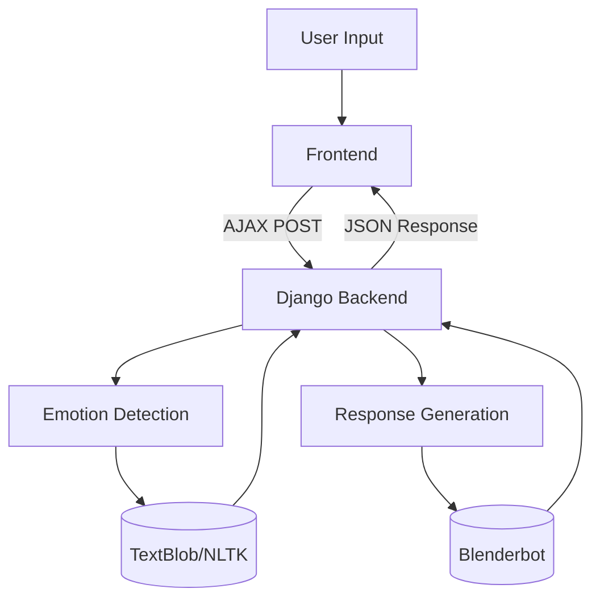

# Emotion-Aware Chatbot

An intelligent chatbot that detects user emotions from text input and provides empathetic responses using advanced NLP models.

## Features

- **Real-time Emotion Detection**: Identifies 6 core emotions (happy, sad, angry, fearful, surprised, neutral)
- **Contextual Response Generation**: Tailors responses based on detected emotion
- **Multi-Theme Interface**: Light, dark, blue, and pink color themes
- **Stress Management**: Special protocols for high-stress situations
- **Conversation Memory**: Maintains context during chats

## Technology Stack

### Frontend
- HTML5, CSS3, JavaScript
- jQuery for AJAX requests
- Tailwind CSS for styling

### Backend
- Django 4.2
- Django REST Framework

### NLP Models
- Emotion Detection: TextBlob + NLTK Vader
- Response Generation: Facebook's Blenderbot-small-90M

## System Architecture

##1-Installation

Prerequisites
Python 3.9+
pip
Node.js (for optional frontend tooling)

##2-Setup
Clone the repository:
bash
git clone [https://github.com/yourusername/emotion-aware-chatbot.git](https://github.com/ranazain9/EmotiChat-The-AI-Powered-Emotion-detector)
cd emotion-aware-chatbot

##3-Set up Python environment:

bash
python -m venv venv
source venv/bin/activate  # On Windows use `venv\Scripts\activate`
pip install -r requirements.txt

##4-Install NLTK data:
python -c "import nltk; nltk.download('vader_lexicon')"

##5-Run migrations:

python manage.py migrate

##6-Start development server:
python manage.py runserver

API Endpoints
Endpoint	Method	Description	Request Format	Response Format
/api/chat/	POST	Process chat message	{"message": "string"}	{"response": "string", "emotion": "string", "status": "string"}
Configuration
Environment variables (set in .env):

ini
DEBUG=True
SECRET_KEY=your-secret-key
ALLOWED_HOSTS=localhost,127.0.0.1
Usage
Access the chat interface at http://localhost:8000

Type your message in the input box

View emotion-detected responses with appropriate styling

Customization
Adding New Themes
Add new theme CSS variables in static/css/styles.css

Update the themes object in the JavaScript

Modifying Emotion Detection
Edit utils/emotion_detection.py to adjust:

Emotion thresholds

Sentiment analysis weights

Additional emotion categories

Troubleshooting
Issue: Model not loading
Solution: Ensure you have internet connection for first-time model downloads

Issue: Emotion detection inaccurate
Solution: Adjust thresholds in detect_emotion() function

